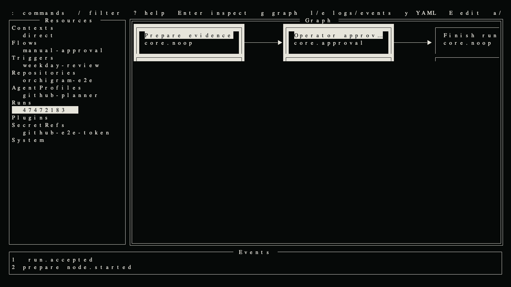

# Orchigram

Orchigram is a local-first, declarative agent workflow orchestrator with a k9s-style terminal interface. It runs as one non-root daemon, stores state in SQLite, and is operated locally or through OpenSSH Unix-socket forwarding. There is no web control plane and no Orchigram-specific user authentication system.

> Status: v0.1 is under active development. Public APIs remain `v1alpha1` until the first tagged release.

[Website](https://alexrett.github.io/orchigram/) · [Operator guide](docs/operator-guide.md) · [Architecture](docs/architecture.md) · [Examples](examples/)



## Shape of the product

- `orchigram` opens the TUI.
- `orchigram server` runs the daemon.
- `orchigram apply/get/describe/delete` manage strict YAML resources.
- `orchigram run`, `flow`, `trigger`, `plugin`, and `context` provide scriptable operations.
- First-party agent, exec, HTTP, and GitHub providers are independent gRPC plugin executables.
- Community plugins build in separate modules against [`sdk/plugin`](sdk/plugin); `orchigram plugin pack` creates deterministic installable bundles locally.

The daemon binds only `/run/orchigram/orchigram.sock` by default. Optional webhook ingress must be explicitly configured and should normally sit behind operator-owned ingress.

## Development

Requirements: Go 1.26, protoc, and Buf.

```console
make generate
make check
make cross-build
```

See [Operator guide](docs/operator-guide.md), [Architecture](docs/architecture.md), [Durability](docs/durability.md), [Flow data contracts](docs/flow-contracts.md), [Resource references](docs/resource-references.md), [Triggers](docs/triggers.md), [Slack tracer](examples/slack/README.md), [GitHub SDLC tracer](docs/github-sdlc.md), [self-SDLC example](examples/self-sdlc/README.md), [echo plugin](examples/plugins/echo/main.go), [Security](docs/security.md), [Plugin authoring](docs/plugin-authoring.md), and [Release process](docs/release.md).

## License

Apache License 2.0.
